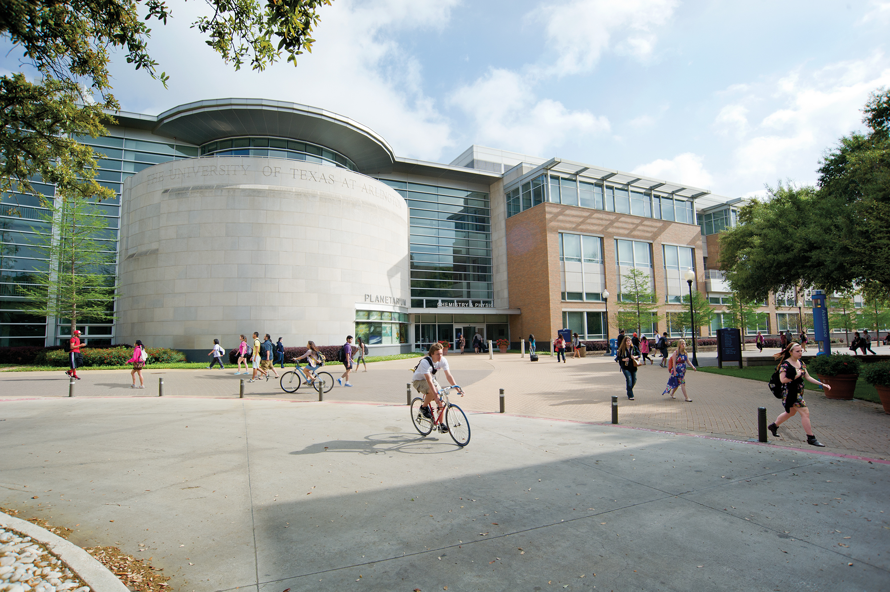

# Charged Higgs UTA 
# Quick Start Documentation

The way that this documentation is structured is in a series of links.
Very many resources That I used to learn the practicle skills needed to do Particle Physics 
were from random internet links and not books. So very often the resource that I found most helpful, wether it be
a reference document, a video series on youtube, or a tutorial outlining steps will look like this. 

[Take the first step...](https://www.youtube.com/watch?v=2atQnvunGCo)
It's a link to cool LO-FI music that you can listen to

Take what you can from these links, and add new ones to this document if you feel youve learned more from it.

Meetings
=================

Our general meetings that take place every Tuesday and Friday in CPB 128 on the UTA campus, we also have a page where we post our results for the week, that also hosts a video calling software called "vidyo" that we use when we are unable to meet physically [here](https://indico.cern.ch/event/884412/). This is hosted on a CERN meeting page called "Indico", that hosts a video room through the Vidyo software and allows us to have a place to post our results or weekly update powerpoints.  Unfortunately you are only able to access the chatroom if you have a CERN account, and it requires a pass pin to get into the chatroom. Ask us for the password to the page, as it is unwise to post it in a public place like this.

Mattermost Collaboration area
================

We as a group, as well as a lot of other CERN affiliated groups have a place where we can all collaborate and message each other in case we need some help or need to post results, before an official meeting. The software is called the Mattermost, and unfortunately, you also need a CERN account to access it. Note that this isnt just for our group, there are hundreds of mattermost channels that you can search for and join in case you are interested in certain topics. Anything from a [ROOT matter most](https://mattermost.web.cern.ch/root) to a machine learning mattermost, and many more are available.

Contributions
====================
If you would like to contribute to either this [documentation](https://github.com/Jcardenas34/UTA-HBSM-New-Member-Quick-Start-Documentation), or [create working examples in code](https://gitlab.cern.ch/jcardena/hbsm-analysis-tutorials), click on the corresponding links to fork a git repo.
Any help is appreciated!

## Works in progress

All of it but specifically id like to add

More about ATLAS and our
charged higgs process, super symmetry and all that

the ATLAS detector

how to write a paper using overleaf or Latex

Where to find papers

Getting started with a CERN account

Want to make a page like this one?
It was made using a software called mkdocs, and the
full documentation is here [mkdocs.org](https://www.mkdocs.org).

