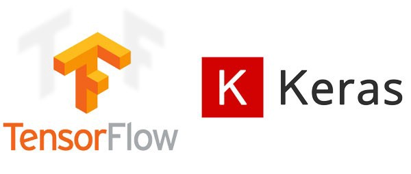

# Getting Started with Neural Networks

As of today, the field of particle physics is moving towards the use of Neural Networks
to help us as particle physicists do our job. They are quickly showing they can out perform
the previous data analysis tool called the Boosted Decision Tree (BDT), When It comes to distinguishing
a process that we are looking for from something that we arent, since they ofentimes look similar and can
be confused.

The resource that I suggest using to learn about neural networks is the series by 3 blue 1 brown, 
here [But what is a Neural Network? | Deep learning, chapter 1](https://www.youtube.com/watch?v=aircAruvnKk&list=PLZHQObOWTQDNU6R1_67000Dx_ZCJB-3pi)

He has created a somewhat easy to follow series of videos that give you a basic idea of how a neural networks functions, as well as gets you familiar with some of the jargon. At the time of this writing, there are 4 videos, so make sure to watch them all. They will serve as a sort of primer for the second document below, or vice versa.

Another useful document is here [Neural Networks From Scratch](https://victorzhou.com/series/neural-networks-from-scratch/)
This was a resource suggested by Susan Bataju, a member of our group. Its a tutorial series that teaches you about 3 of the most common types of neural networks, the Deep, Recurrant and Convolutional Neural networks, (DNN,RNN and CNN. Its a pretty detailed set of tutorials that even gives some examples in code of how to build a neural net. 
