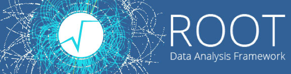

# Everything ROOT

  As you have probably already realized, Doing physics has a lot of prerequisites. You have to learn a LOT
of stuff before you can start doing actual research. But this tool, [ROOT](https://root.cern.ch/) is the primary one that
we use in the High energy physics communuty. It is a programming software that's compatible with both C++ and Python and used to Analyze data and create the plots that we use to visualize our results. It has a lot of capabilities, and using it with python makes the whole process of data analysis just a bit easier, Although ROOT is notoriously complicated and difficult to learn, My hope is to try and give you the basics so you can get on your way to performing data analysis and contribute to group progress as quickly as possible.
